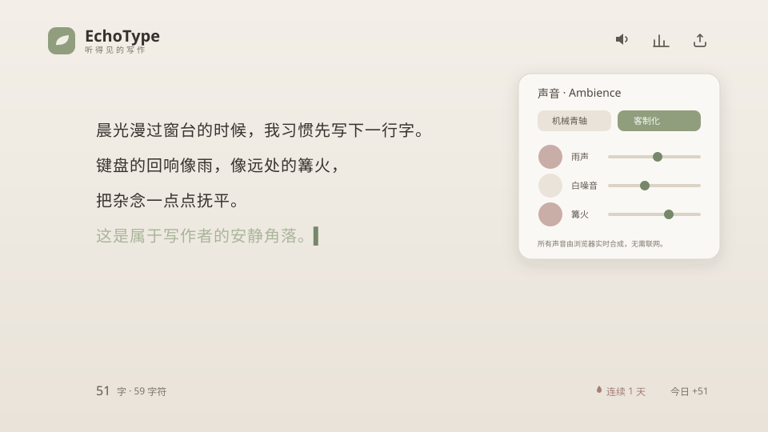

<div align="center">


# EchoType · 听得见的写作

**带打字音效和氛围感的极简写作工具 —— 为写作爱好者打造。**

每一次敲击都有回响，每一段文字都被温柔安放。

<p>
  
  
  
  
  
</p>



</div>

---

## ✨ 这是什么

EchoType 是一个**纯前端、完全离线**的写作应用。打开就写，没有登录、没有云端、没有干扰。它把"写作的仪式感"做到极致：机械键盘的回响、窗外的雨声、远处的篝火，配上治愈的莫兰迪配色，让你愿意每天在这里坐下来，写一点点。

所有内容只保存在你自己的浏览器里（`localStorage`），关掉网络也照常运行。

## 🎬 功能一览

| | 功能 | 说明 |
|---|---|---|
| ✍️ | **极简写作界面** | 衬线大字、宽行距、纸感留白，专注于文字本身，输入即自动保存 |
| ⌨️ | **打字音效** | 每次敲击都有真实的机械键盘回响，4 种音色可切换、可调音量；回车键带老打字机的"叮——咔哒"进纸声 |
| 🌧️ | **环境氛围音 + 视觉层** | 雨声 / 白噪音 / 篝火 / 森林鸟鸣，可多轨叠加、独立调音；开启时背景会飘细雨、亮起暖光，听觉与视觉共同营造氛围 |
| 🧘 | **专注 & 禅模式** | 专注模式一键隐藏全部界面；禅模式让当前行始终停在屏幕中央（打字机式滚动），沉浸式书写 |
| 🎯 | **每日目标 + 仪式感** | 自定义每日字数目标，达成时叶子"开花"、花瓣绽放，给坚持一个温柔的奖励 |
| 📊 | **每日写作统计** | 今日字数、连续写作天数、会话字数、敲击次数，以及 GitHub 风格的写作热力图 |
| 📤 | **一键导出** | 导出为 `.txt` / `Markdown`，或一键复制全文 |

### ⌨️ 键盘音色

`客制化（默认）` · `机械青轴` · `复古打字机` · `轻柔薄膜` —— 由 Web Audio API 实时合成，每个键都是"瞬态咔哒 + 键体共鸣 + 触底噪声"三层叠加，并带有细微的随机音高，听感真实而不机械。

## 🚀 快速开始

> 需要 [Node.js](https://nodejs.org/) 18 或更高版本。

```bash
# 克隆项目
git clone https://github.com/<your-name>/echotype.git
cd echotype

# 安装依赖
npm install

# 启动本地开发服务器 → http://localhost:5173
npm run dev
```

构建生产版本：

```bash
npm run build      # 输出到 dist/
npm run preview    # 本地预览构建产物
```

`dist/` 是纯静态文件，可直接部署到 **Vercel / Netlify / GitHub Pages** 等任意静态托管平台。

## ⌨️ 快捷键

| 操作 | 快捷键 |
|---|---|
| 切换专注模式 | `Ctrl / ⌘` + `Enter` |
| 退出专注 / 禅模式 | `Esc` |
| 快速导出为 .txt | `Ctrl / ⌘` + `S` |

## 🛠 技术栈

- **React 18 + Vite** —— 界面与极速构建
- **Tailwind CSS** —— 莫兰迪治愈配色与样式系统
- **Web Audio API** —— 实时合成全部音效（键盘音、雨声、篝火……），**零音频素材、完全离线**
- **localStorage** —— 正文、声音偏好与写作统计的本地持久化

> 💡 **关于声音**：项目最初规划使用 Howler.js，但为了让应用**不依赖任何音频文件、彻底离线**，最终改为用 Web Audio API 程序化合成全部声音。没有一个 mp3，所有回响都是浏览器即时算出来的。

## 📁 项目结构

```
src/
├── App.jsx                 # 主界面与状态编排
├── audio/
│   └── AudioEngine.js      # Web Audio 音效合成引擎（键盘音 + 氛围音）
├── hooks/
│   ├── useLocalStorage.js  # 通用本地持久化
│   └── useStats.js         # 字数 / 连续天数 / 7 日统计
├── components/
│   ├── SoundPanel.jsx      # 声音设置面板
│   ├── StatsPanel.jsx      # 写作统计面板
│   └── Icons.jsx           # 线性图标
└── utils/
    └── export.js           # txt / Markdown / 剪贴板导出
```

## 🗺 路线图

一些已经落地与仍在路上的想法：

- [x] ⏎ 回车键的老打字机"叮——咔哒"进纸声
- [x] 🌧️ 氛围视觉层：开雨声时飘细雨、开篝火时底部暖光呼吸
- [x] 🎯 每日字数目标 + 达成时的"叶子开花"治愈动画
- [x] 📅 写作日历热力图（GitHub 贡献图风格）
- [x] 🧘 禅模式：打字机式逐行居中滚动
- [ ] 🌙 深色夜间模式 & 多套莫兰迪主题
- [ ] 📚 本地多篇 / 草稿箱管理
- [ ] 📱 PWA：可安装到桌面、断网可用

欢迎提 Issue 或 PR 一起把它做得更好。

## 🤝 贡献

欢迎任何形式的贡献 —— 新音色、新氛围、Bug 修复或体验优化。Fork → 改 → 提 PR 即可。

## 📄 许可

[MIT](LICENSE) © EchoType

<div align="center">
<sub>用文字陪伴自己，从今天开始 ✦</sub>
</div>
